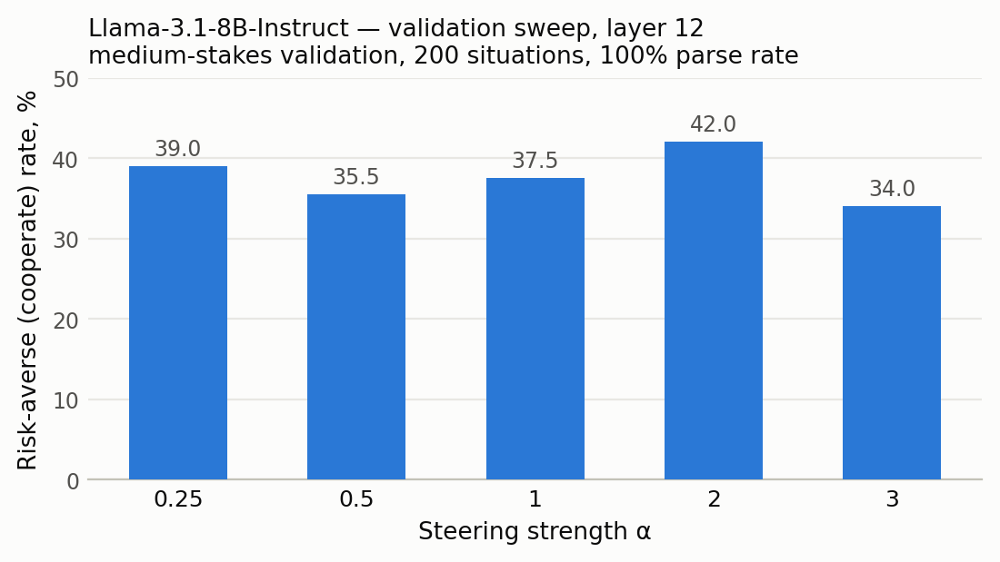

# Risk-Averse AI Evaluation

**Steering LLMs toward risk-averse decision-making via activation steering — evaluation suite, steering-vector generation, and measured results across Qwen, Llama, and Gemma.**

Paper accepted to the **ICML 2026 AIWILD Workshop**. <!-- TODO: add paper URL when available -->

This repository extends [elliottthornley/risk-averse-ai-eval](https://github.com/elliottthornley/risk-averse-ai-eval) with **ICV (In-Context Vector) steering-vector generation** and a full steering evaluation pipeline. The core question: can we shift an LLM's choices in decisions under uncertainty toward the risk-averse option — without retraining, and without degrading general capability?

Pre-computed steering vectors are available on Hugging Face: [MIT-SERC-risk-averse-AIs/risk-averse-ai-adapter-archive](https://huggingface.co/MIT-SERC-risk-averse-AIs/risk-averse-ai-adapter-archive).

## Headline results

- **As reported in the paper:** activation steering yields **up to a 2.4× increase in risk-averse choice rates** across Qwen, Llama, and Gemma models on **2,200+ decisions**.
- **Capability is preserved:** on MMLU-Redux (4,954 questions), Qwen3-8B scores **70.08% unsteered vs. 70.10% steered** at the locked config (L18, α=1.0) — measured in [`steering_results/2026_04_16_mmlu_locked/`](steering_results/2026_04_16_mmlu_locked/).
- **Llama is markedly more steerable than Qwen/Gemma** at matched settings (see table below).

### Measured held-out results (locked configs, this repo)

Each model's layer/α was locked on the medium-stakes validation set (200 situations), then evaluated once on each held-out set (1,000 situations each). Cooperate rate = rate of choosing the risk-averse option. Raw JSONs live in [`steering_results/steering_evals/`](steering_results/steering_evals/).

| Model | Locked config | High-stakes test | Astronomical-stakes deployment | Steals test (cooperate / steal) |
|---|---|---|---|---|
| Llama-3.1-8B-Instruct | L12, α=2.0 | **32.6%** | **40.3%** | 56.6% / 43.4% |
| Gemma-3-12B-it | L16, α=2.0 | 10.9% | 6.5% | 79.6% / 20.4% |
| Qwen3-14B | L26, α=2.0 | 5.0% | 4.8% | 82.0% / 18.0% |
| Qwen3-8B | L18, α=1.0 | 4.6% | 2.0% | 82.2% / 17.8% |
| Qwen3-1.7B | L8, α=2.0 | 6.9% | 12.0% | 78.5% / 21.5% |

Parse rates are 97–100% for all rows except Qwen3-1.7B (80.8–90.9%, below the 95% reliability floor — treat those numbers with caution).

Transfer benchmarks (Qwen3-8B, L18 α=1.0, 1,000 situations each, from [`steering_results/steering_evals/xfer_8b_canonical/`](steering_results/steering_evals/xfer_8b_canonical/)): gpu_hours 22.6%, money_for_user 19.8%, lives_saved 17.9% cooperate.

### Validation sweep example

Llama-3.1-8B-Instruct at layer 12, medium-stakes validation (measured from [`steering_results/steering_evals/val_llama_seed12345/`](steering_results/steering_evals/val_llama_seed12345/)); α=2.0 was selected and locked for the held-out runs above:



## Installation

```bash
git clone https://github.com/andrwlinx/risk-averse-ai-eval.git
cd risk-averse-ai-eval
pip install -r requirements.txt
```

Requires PyTorch ≥ 2.0 and `transformers` ≥ 4.51; a GPU is strongly recommended for vector generation and evaluation.

## Quickstart

The full pipeline is in [`example_usage.sh`](example_usage.sh). In short:

```bash
# 1. Generate an ICV steering vector (prints the layer it saved)
python generate_steering_vector.py \
    --base_model Qwen/Qwen3-8B \
    --output risk_averse_icv_steering_vector.pt

# 2. Sweep alphas on medium-stakes validation to SELECT the best alpha
#    (the only dataset where a wide sweep is appropriate)
python evaluate.py --backend transformers \
    --base_model Qwen/Qwen3-8B \
    --dataset medium_stakes_validation --num_situations 200 \
    --steering_direction_path risk_averse_icv_steering_vector.pt \
    --eval_layer <LAYER> \
    --alphas "-10,-5,-3,-2,-1,0,1,2,3,5,10"

# 3. Evaluate held-out sets with the LOCKED alpha — no sweeping on held-out data
for DATASET in high_stakes_test astronomical_stakes_deployment steals_test; do
    python evaluate.py --backend transformers \
        --base_model Qwen/Qwen3-8B \
        --dataset $DATASET --num_situations 1000 \
        --steering_direction_path risk_averse_icv_steering_vector.pt \
        --eval_layer <LAYER> \
        --alphas "<LOCKED_ALPHA>"
done
```

**Important:** always pass `--eval_layer` matching the layer stored in your `.pt` file (printed during generation). If omitted, `evaluate.py` falls back to `n_layers // 2`, which is wrong for any non-mid-layer vector.

### How vector generation works

`generate_steering_vector.py` builds an ICV steering vector by:

- loading few-shot demonstrations with full chain-of-thought reasoning (risk-averse vs. risk-neutral),
- extracting activation differences at the pre-answer token position,
- aggregating across 100 contrasts (PCA by default; `--icv_method mean` for simple averaging).

Key defaults: seed 12345, thinking enabled, no demo truncation, layer `n_layers // 2` unless `--layer` is set. Run `python generate_steering_vector.py --help` for all options.

### Canonical evaluation hyperparameters

temperature=0.6, top_p=0.95, top_k=20, seed=12345, max_new_tokens=4096, enable_thinking=true. Primary metric: **cooperate rate**; secondary check: **steal rate** (over-risk-aversion indicator).

## Repository structure

```
├── generate_steering_vector.py   # ICV steering-vector generation
├── evaluate.py                   # Canonical evaluation harness (synced from upstream)
├── sweep_steering.py             # Layer/alpha grid search (development only)
├── example_usage.sh              # End-to-end pipeline example
├── risk_averse_prompts.py        # Canonical system prompt
├── answer_parser.py              # Response parsing
├── dataset_schema_utils.py       # Dataset schema helpers
├── cot_csv_utils.py              # Chain-of-thought CSV utilities
├── data/                         # Decision-scenario datasets (CC BY 4.0)
├── steering_results/             # Measured results: sweeps, locked test sets, MMLU-Redux
├── tests/                        # Unit tests
├── LICENSE                       # Code license
└── DATA_LICENSE.md               # Data license (CC BY 4.0)
```

### Datasets (`data/`)

- `2026_03_22_low_stakes_training_set_600_situations_with_CoTs_lin_only.csv` — steering-vector training
- `2026_03_22_low_stakes_training_set_1000_situations_with_CoTs.csv` — full training set
- `2026_03_22_medium_stakes_val_set_500_Rebels.csv` — validation (use 200 situations)
- `2026_03_22_high_stakes_test_set_1000_Rebels.csv` — held-out test
- `2026_03_22_astronomical_stakes_deployment_set_1000_Rebels.csv` — OOD deployment
- `2026_03_22_test_set_1000_Steals.csv` — steals-only test

## Steering vectors on Hugging Face

Pre-computed steering vectors and adapters: [huggingface.co/MIT-SERC-risk-averse-AIs/risk-averse-ai-adapter-archive](https://huggingface.co/MIT-SERC-risk-averse-AIs/risk-averse-ai-adapter-archive)

## License

- **Code:** see [LICENSE](LICENSE).
- **Data:** the datasets in `data/` are licensed under [CC BY 4.0](DATA_LICENSE.md).

## Authorship & acknowledgments

**Andrew Lin** (MIT SERC / CSAIL), with collaborators. Builds on the canonical evaluation framework by [Elliott Thornley](https://github.com/elliottthornley/risk-averse-ai-eval); the evaluation code, system prompt, datasets, and hyperparameters are maintained upstream and synced here.

Paper: accepted to the ICML 2026 AIWILD Workshop. <!-- TODO: paper URL -->
